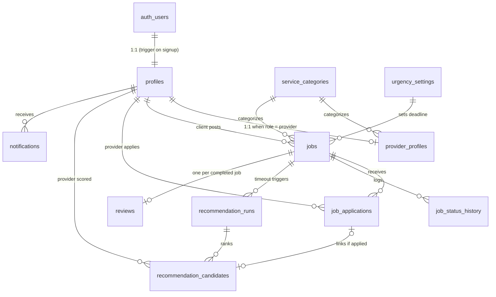

# TaskBuddy — Backend Data Schema Specification

> **Purpose of this document:** This is the authoritative data schema and recommendation-system
> specification for the TaskBuddy backend. It is written to be used directly as the prompt/basis
> for building the backend that serves the TaskBuddy **mobile app and website**.
> Follow it as the source of truth for table structure, naming, lifecycle rules, and
> ML-feature computation. Anything listed under *Out of Scope* must NOT be invented or added.

**Target platform:** Supabase (PostgreSQL 15+, Supabase Auth, Row Level Security, pg_cron)
**Companion service:** a small Python (FastAPI) service that hosts the trained scikit-learn
recommendation model (see [Recommendation Engine Integration](#9-recommendation-engine-integration)).

---

## Table of Contents

1. [Product Context](#1-product-context)
2. [The Matching Flow](#2-the-matching-flow)
3. [Schema Conventions](#3-schema-conventions)
4. [Enumerated Types](#4-enumerated-types)
5. [Tables (DDL)](#5-tables-ddl)
6. [Entity-Relationship Diagram](#6-entity-relationship-diagram)
7. [Job Lifecycle & Urgency Timeouts](#7-job-lifecycle--urgency-timeouts)
8. [ML Feature Mapping](#8-ml-feature-mapping)
9. [Recommendation Engine Integration](#9-recommendation-engine-integration)
10. [Triggers & Functions](#10-triggers--functions)
11. [Row Level Security Outline](#11-row-level-security-outline)
12. [Seed Data](#12-seed-data)
13. [Retraining Data Export](#13-retraining-data-export)
14. [Out of Scope](#14-out-of-scope)

---

## 1. Product Context

TaskBuddy is a Philippine home-services marketplace. **Clients** post jobs in five service
categories — Plumbing, Cleaning, Handyman, Manicure, Pedicure — and **providers** (freelance
service workers) apply to them. Job descriptions and provider bios are written in
Taglish (mixed Filipino/English).

The differentiating feature is an **ML recommendation engine**: a trained Random Forest
classifier (scikit-learn) that scores job–provider pairs by hiring likelihood. It was developed
and validated in the companion ML repository ("TaskBuddy ML"): winner = Random Forest with
`n_estimators=50, max_depth=10, max_features='sqrt', min_samples_split=5, class_weight='balanced'`,
0.8123 accuracy / 0.8827 ROC-AUC over 100 group-aware splits.

The model consumes **14 raw input features** per job–provider pair (listed in
[Section 8](#8-ml-feature-mapping)). All preprocessing (ordinal encoding, TF-IDF + SVD for the
two text features, scaling) happens **inside the persisted sklearn Pipeline** — the backend must
pass raw values with the exact column names and types shown in Section 8, never pre-encoded values.

This schema has two jobs:

1. **Serve the marketplace flow** (accounts, job posting, applications, hiring, reviews).
2. **Serve the recommendation system**: compute all 14 model features from live data at scoring
   time, and snapshot every scored candidate with its eventual outcome so production data
   accumulates as future retraining rows.

---

## 2. The Matching Flow

This is the exact product flow the schema must support:

1. A client posts a job (category, Taglish description, location, urgency level).
2. Providers browse open jobs and **apply organically**. The client may approve **exactly one**
   provider at any time.
3. If the job has no approved provider when its **urgency timeout** elapses
   (**urgent = 5 min, normal = 10 min, flexible = 15 min** after posting), the system triggers
   the **recommendation engine**:
   - The engine builds the eligible provider pool, computes the 14 features for each
     job–provider pair, scores them with the model, and stores the ranked results.
   - The **top-N providers (default N = 8)** each receive a notification inviting them to the job.
4. Recommended providers may then apply like any other applicant; the client still approves
   exactly one.
5. When the client approves an application, the job is assigned; it then progresses to
   completion, after which the client leaves a rating/review.

---

## 3. Schema Conventions

- **Primary keys:** `uuid` with `default gen_random_uuid()`, except small lookup/config tables.
- **Timestamps:** always `timestamptz`. Every table has `created_at timestamptz not null default now()`;
  mutable tables also have `updated_at` maintained by trigger.
- **Naming:** `snake_case` tables and columns; singular enum type names; `fk_`-free natural names.
- **Time zone:** business-facing time derivations (`hour_posted`, `day_of_week`) use `Asia/Manila`.
- **Locations:** plain `latitude double precision` / `longitude double precision` columns plus a
  haversine SQL function (Section 10). PostGIS is an optional upgrade, not required.
- **Category strings** stored in `service_categories.name` must exactly match the strings the
  model was trained on: `Plumbing`, `Cleaning`, `Handyman`, `Manicure`, `Pedicure` (case-sensitive).
- **User-generated text limits** — enforced by CHECK constraints in the DDL (characters), with
  the word figures as frontend form guidance. The two ML text features get both a floor and a
  cap: the TF-IDF pipeline was trained on short templated Taglish text, so near-empty text gives
  the model no signal and very long text dilutes it.

  | Column | Characters | ≈ Words | ML feature? |
  |---|---|---|---|
  | `jobs.title` | 5–120 | 1–15 | no |
  | `jobs.description` | 20–750 | 5–100 | **yes** (`job_description`) |
  | `provider_profiles.bio` | 20–400 | 5–60 | **yes** (`provider_bio`) |
  | `job_applications.cover_message` | ≤ 300 | ≤ 40 | no |
  | `reviews.comment` | ≤ 500 | ≤ 70 | no |

---

## 4. Enumerated Types

```sql
create type user_role          as enum ('client', 'provider');
create type job_urgency        as enum ('urgent', 'normal', 'flexible');
create type job_status         as enum ('open', 'recommending', 'assigned',
                                        'in_progress', 'completed', 'cancelled', 'expired');
create type application_status as enum ('pending', 'accepted', 'rejected', 'withdrawn');
create type application_source as enum ('organic', 'recommended');
create type recommendation_trigger as enum ('timeout', 'manual');
create type notification_type  as enum ('recommendation_invite', 'application_update', 'job_update');
```

> Note: the enum labels `urgent | normal | flexible` must match the model's training values
> for the `job_urgency` feature exactly (lowercase).

---

## 5. Tables (DDL)

### 5.1 `profiles` — shared identity for both roles

One row per authenticated user, `id` = Supabase `auth.users.id`. Created automatically by
trigger on signup (Section 10).

```sql
create table profiles (
    id           uuid primary key references auth.users (id) on delete cascade,
    role         user_role not null,
    full_name    text not null,
    phone        text,
    avatar_url   text,                       -- Supabase Storage public URL
    address      text,
    city         text,
    latitude     double precision,           -- default location; jobs carry their own coords
    longitude    double precision,
    deactivated_at timestamptz,              -- soft delete / suspension
    created_at   timestamptz not null default now(),
    updated_at   timestamptz not null default now()
);
```

### 5.2 `service_categories` — lookup

```sql
create table service_categories (
    id         smallint generated always as identity primary key,
    name       text not null unique,         -- must match ML training strings exactly
    is_active  boolean not null default true,
    created_at timestamptz not null default now()
);
```

### 5.3 `provider_profiles` — provider-only attributes + cached ML stats

1:1 extension of `profiles` for `role = 'provider'`. The three `cached_*` columns are
denormalized aggregates maintained by triggers (Section 10) so recommendation scoring never
needs expensive on-the-fly aggregation.

```sql
create table provider_profiles (
    profile_id    uuid primary key references profiles (id) on delete cascade,
    category_id   smallint not null references service_categories (id),
    bio           text not null
                  check (char_length(bio) between 20 and 400),  -- Taglish self-description (ML feature: provider_bio)
    years_experience numeric(4,1) not null default 0,
    is_available  boolean not null default true, -- provider-controlled toggle (ML feature)
    service_radius_km numeric(5,1) not null default 15.0,
    cached_avg_rating        numeric(3,2),       -- null until first review
    cached_ratings_count     integer not null default 0,
    cached_completed_jobs    integer not null default 0,
    cached_avg_response_hrs  numeric(6,2),       -- null until first responded invite
    created_at    timestamptz not null default now(),
    updated_at    timestamptz not null default now()
);

create index idx_provider_profiles_category   on provider_profiles (category_id);
create index idx_provider_profiles_available  on provider_profiles (is_available) where is_available;
```

### 5.4 `urgency_settings` — recommendation timeout config

```sql
create table urgency_settings (
    urgency         job_urgency primary key,
    timeout_minutes integer not null check (timeout_minutes > 0)
);
```

Seeded with: `urgent = 5`, `normal = 10`, `flexible = 15` (Section 12).

### 5.5 `jobs`

```sql
create table jobs (
    id           uuid primary key default gen_random_uuid(),
    client_id    uuid not null references profiles (id),
    category_id  smallint not null references service_categories (id),
    title        text not null check (char_length(title) between 5 and 120),
    description  text not null
                 check (char_length(description) between 20 and 750),  -- Taglish (ML feature: job_description)
    urgency      job_urgency not null default 'normal',
    status       job_status not null default 'open',
    address      text not null,
    latitude     double precision not null,
    longitude    double precision not null,
    posted_at    timestamptz not null default now(),
    recommendation_deadline timestamptz not null,  -- set by trigger: posted_at + urgency timeout
    assigned_provider_id uuid references profiles (id),
    assigned_at  timestamptz,
    completed_at timestamptz,
    created_at   timestamptz not null default now(),
    updated_at   timestamptz not null default now(),
    constraint chk_assignment_consistency
        check (status not in ('assigned','in_progress','completed') or assigned_provider_id is not null)
);

create index idx_jobs_status_deadline on jobs (status, recommendation_deadline)
    where status = 'open';                    -- the timeout poller's index
create index idx_jobs_client   on jobs (client_id);
create index idx_jobs_category on jobs (category_id, status);
```

### 5.6 `job_status_history` — audit trail of lifecycle transitions

```sql
create table job_status_history (
    id         bigint generated always as identity primary key,
    job_id     uuid not null references jobs (id) on delete cascade,
    old_status job_status,
    new_status job_status not null,
    changed_by uuid references profiles (id),  -- null when system-initiated
    changed_at timestamptz not null default now()
);

create index idx_job_status_history_job on job_status_history (job_id, changed_at);
```

### 5.7 `job_applications`

```sql
create table job_applications (
    id          uuid primary key default gen_random_uuid(),
    job_id      uuid not null references jobs (id) on delete cascade,
    provider_id uuid not null references profiles (id),
    source      application_source not null default 'organic',
    status      application_status not null default 'pending',
    cover_message text check (char_length(cover_message) <= 300),
    applied_at  timestamptz not null default now(),
    decided_at  timestamptz,                  -- when client accepted/rejected
    created_at  timestamptz not null default now(),
    updated_at  timestamptz not null default now(),
    unique (job_id, provider_id)
);

-- Exactly ONE accepted application per job — the core marketplace invariant.
create unique index uq_job_applications_one_accepted
    on job_applications (job_id) where status = 'accepted';

create index idx_job_applications_provider on job_applications (provider_id, status);
```

### 5.8 `recommendation_runs` — one row per scoring event

```sql
create table recommendation_runs (
    id            uuid primary key default gen_random_uuid(),
    job_id        uuid not null references jobs (id) on delete cascade,
    triggered_by  recommendation_trigger not null default 'timeout',
    model_version text not null,              -- e.g. 'rf-a-v1' — set by the model service
    pool_size     integer not null,           -- eligible providers considered
    created_at    timestamptz not null default now()
);

create index idx_recommendation_runs_job on recommendation_runs (job_id);
```

### 5.9 `recommendation_candidates` — ranked results + frozen feature snapshot

This table is the heart of the recommendation system. Each row stores the model's output for
one job–provider pair **and the exact 14 feature values at scoring time** (column names match
the ML training dataset). `was_hired` is backfilled when the job closes, turning every row
into a labeled retraining example.

```sql
create table recommendation_candidates (
    id          uuid primary key default gen_random_uuid(),
    run_id      uuid not null references recommendation_runs (id) on delete cascade,
    provider_id uuid not null references profiles (id),
    rank        smallint not null,            -- 1 = best
    score       numeric(6,5) not null,        -- model probability of hire
    notified_at timestamptz,                  -- set when invite notification is created (top-N only)
    application_id uuid references job_applications (id),  -- set if the provider applied
    was_hired   boolean,                      -- backfilled at job completion/cancellation

    -- Frozen ML feature snapshot (names/types mirror the training CSV) --
    skills_match                smallint not null,          -- 0/1
    distance_km                 numeric(6,2) not null,
    provider_avg_rating         numeric(3,2) not null,
    provider_completed_jobs     integer not null,
    provider_availability       smallint not null,          -- 0/1
    job_idle_duration_hrs       numeric(8,2) not null,
    provider_response_time_hrs  numeric(6,2) not null,
    provider_years_experience   numeric(4,1) not null,
    hour_posted                 smallint not null,
    provider_skill_category     text not null,
    day_of_week                 text not null,
    job_urgency                 text not null,
    job_description             text not null,
    provider_bio                text not null,

    created_at  timestamptz not null default now(),
    unique (run_id, provider_id)
);

create index idx_recommendation_candidates_provider on recommendation_candidates (provider_id);
create index idx_recommendation_candidates_label
    on recommendation_candidates (was_hired) where was_hired is not null;
```

### 5.10 `reviews` — source of `provider_avg_rating`

One review per completed job, written by the job's client about the assigned provider.

```sql
create table reviews (
    id          uuid primary key default gen_random_uuid(),
    job_id      uuid not null unique references jobs (id) on delete cascade,
    client_id   uuid not null references profiles (id),
    provider_id uuid not null references profiles (id),
    rating      smallint not null check (rating between 1 and 5),
    comment     text check (char_length(comment) <= 500),
    created_at  timestamptz not null default now()
);

create index idx_reviews_provider on reviews (provider_id);
```

### 5.11 `notifications` — minimal, scoped to this flow

```sql
create table notifications (
    id           uuid primary key default gen_random_uuid(),
    recipient_id uuid not null references profiles (id) on delete cascade,
    type         notification_type not null,
    title        text not null,
    body         text not null,
    data         jsonb not null default '{}',  -- { "job_id": ..., "application_id": ... }
    read_at      timestamptz,
    created_at   timestamptz not null default now()
);

create index idx_notifications_recipient on notifications (recipient_id, read_at, created_at desc);
```

---

## 6. Entity-Relationship Diagram



---

## 7. Job Lifecycle & Urgency Timeouts

```
                    client approves an application
   open ────────────────────────────────────────────► assigned ──► in_progress ──► completed
    │                                                     ▲                            │
    │ recommendation_deadline passes                      │                            ▼
    │ with no accepted application                        │                     (review written)
    ▼                                                     │
 recommending ── top-N providers notified; they apply ────┘
    │
    │ no acceptance within 24 h of posting (tunable constant)
    ▼
 expired                    (client may cancel from any pre-completion state ──► cancelled)
```

Rules:

- `recommendation_deadline = posted_at + timeout_minutes(urgency)` from `urgency_settings`:
  **urgent = 5 min, normal = 10 min, flexible = 15 min**. Set by trigger on insert (Section 10).
- A pg_cron job runs **every minute** and transitions `open → recommending` for jobs past their
  deadline with no accepted application, then invokes the recommendation service (Section 9).
- The `open → recommending` transition happens at most once per job via the timeout path;
  additional runs are only possible with `triggered_by = 'manual'`.
- Accepting an application (from either an `open` or `recommending` job) sets
  `jobs.assigned_provider_id`, `assigned_at`, `status = 'assigned'`, and auto-rejects all other
  pending applications for that job.
- Every status change is recorded in `job_status_history` by trigger.
- On terminal states (`completed`, `cancelled`, `expired`), backfill
  `recommendation_candidates.was_hired` for all candidates of that job:
  `true` where the candidate's provider is the assigned provider of a completed job, else `false`.

---

## 8. ML Feature Mapping

The model service must receive, for each job–provider pair, a record with **exactly these
14 columns** (names and raw types as trained; the sklearn Pipeline does all encoding internally):

| # | Feature (exact column name) | Type | Live source |
|---|---|---|---|
| 1 | `skills_match` | int 0/1 | `provider_profiles.category_id = jobs.category_id` |
| 2 | `distance_km` | float | `haversine_km(jobs.latitude, jobs.longitude, profiles.latitude, profiles.longitude)` |
| 3 | `provider_avg_rating` | float | `provider_profiles.cached_avg_rating`; fallback **3.0** when null (new provider) |
| 4 | `provider_completed_jobs` | int | `provider_profiles.cached_completed_jobs` |
| 5 | `provider_availability` | int 0/1 | `provider_profiles.is_available` |
| 6 | `job_idle_duration_hrs` | float | `extract(epoch from (now() - jobs.posted_at)) / 3600` at scoring time |
| 7 | `provider_response_time_hrs` | float | `provider_profiles.cached_avg_response_hrs`; fallback **2.0** when null |
| 8 | `provider_years_experience` | float | `provider_profiles.years_experience` |
| 9 | `hour_posted` | int | `extract(hour from jobs.posted_at at time zone 'Asia/Manila')` |
| 10 | `provider_skill_category` | text | `service_categories.name` of the provider's category |
| 11 | `day_of_week` | text | `trim(to_char(jobs.posted_at at time zone 'Asia/Manila', 'Day'))` → `'Monday'`…`'Sunday'` |
| 12 | `job_urgency` | text | `jobs.urgency::text` (`'urgent' / 'normal' / 'flexible'`) |
| 13 | `job_description` | text | `jobs.description` |
| 14 | `provider_bio` | text | `provider_profiles.bio` |

Definitions the backend must implement:

- **`cached_avg_response_hrs`** = average of
  `extract(epoch from (application.applied_at - candidate.notified_at)) / 3600`
  over the provider's **last 20 responded recommendation invites**
  (rows in `recommendation_candidates` where `notified_at` and `application_id` are both set).
  Recomputed by trigger whenever such a link is created. Invites the provider ignored are
  excluded. New providers have `null` → the scoring query substitutes the fallback **2.0 h**.
- **Fallback values** (3.0 rating, 2.0 h response) are tunable constants; keep them in the model
  service's config, not hardcoded in SQL scattered across the codebase.
- **Eligible provider pool** for a scoring run: providers with `is_available = true`,
  `deactivated_at is null`, who have not already applied to the job, and whose category matches
  the job **or** whose distance to the job is within their `service_radius_km`. `pool_size` on
  `recommendation_runs` records how many were scored.

### Feature-vector SQL function

Implement a function the model service calls per scoring run:

```sql
create or replace function fn_job_provider_features(p_job_id uuid)
returns table (
    provider_id uuid,
    skills_match smallint,
    distance_km numeric,
    provider_avg_rating numeric,
    provider_completed_jobs integer,
    provider_availability smallint,
    job_idle_duration_hrs numeric,
    provider_response_time_hrs numeric,
    provider_years_experience numeric,
    hour_posted smallint,
    provider_skill_category text,
    day_of_week text,
    job_urgency text,
    job_description text,
    provider_bio text
)
language sql stable as $$
    select
        pp.profile_id,
        (pp.category_id = j.category_id)::int::smallint,
        round(haversine_km(j.latitude, j.longitude, pr.latitude, pr.longitude)::numeric, 2),
        coalesce(pp.cached_avg_rating, 3.0),
        pp.cached_completed_jobs,
        pp.is_available::int::smallint,
        round((extract(epoch from (now() - j.posted_at)) / 3600)::numeric, 2),
        coalesce(pp.cached_avg_response_hrs, 2.0),
        pp.years_experience,
        extract(hour from j.posted_at at time zone 'Asia/Manila')::smallint,
        sc.name,
        trim(to_char(j.posted_at at time zone 'Asia/Manila', 'Day')),
        j.urgency::text,
        j.description,
        pp.bio
    from jobs j
    cross join provider_profiles pp
    join profiles pr on pr.id = pp.profile_id
    join service_categories sc on sc.id = pp.category_id
    where j.id = p_job_id
      and pp.is_available
      and pr.deactivated_at is null
      and pr.latitude is not null and pr.longitude is not null  -- providers without a location can't be scored
      and not exists (select 1 from job_applications ja
                      where ja.job_id = j.id and ja.provider_id = pp.profile_id)
      and (pp.category_id = j.category_id
           or haversine_km(j.latitude, j.longitude, pr.latitude, pr.longitude)
              <= pp.service_radius_km);
$$;
```

---

## 9. Recommendation Engine Integration

Supabase Edge Functions run Deno, not Python, so the sklearn model lives in a **separate
Python FastAPI service** (deploy anywhere that runs Python: Railway/Render/Fly/VPS).

**Model artifact:** the ML repository (`TaskBuddy ML`) trains and evaluates but does not persist
a model file. The backend project must produce the artifact once:
fit the winning pipeline — the shared preprocessing `ColumnTransformer` (passthrough numerics,
`OrdinalEncoder` for the 3 categoricals, per-text-column `TfidfVectorizer(sublinear_tf=True)` →
`TruncatedSVD(n_components=20, random_state=42)`) followed by
`RandomForestClassifier(n_estimators=50, max_depth=10, max_features='sqrt',
min_samples_split=5, class_weight='balanced', random_state=42)` — on the **full**
`taskbuddy_synthetic_dataset.csv` (all 40,000 rows; evaluation is already done, so no rows need
holding out — just drop the `hire_probability` audit column), and save with `joblib.dump()`.
Version it (`rf-a-v1`).
Replace with a model retrained on real data once enough labeled rows accumulate (Section 13).

**Scoring flow (per timed-out job):**

1. pg_cron (every minute) finds `open` jobs past `recommendation_deadline` with no accepted
   application, sets them to `recommending`, and notifies the model service
   (HTTP call via `pg_net`, or the service polls a queue view — implementer's choice).
2. The service calls `fn_job_provider_features(job_id)` (via Supabase service-role key or a
   direct Postgres connection), runs `pipeline.predict_proba(df)[:, 1]`, and:
   - inserts one `recommendation_runs` row (`model_version`, `pool_size`);
   - inserts one `recommendation_candidates` row **per scored provider** (full feature snapshot),
     ranked by score;
   - sets `notified_at` and creates a `notifications` row (`type = 'recommendation_invite'`)
     for the **top N = 8** only.
3. When a provider who was a candidate applies, the backend links
   `recommendation_candidates.application_id` and sets `job_applications.source = 'recommended'`.

**Column order/name discipline:** build the scoring DataFrame directly from the function's
result set — the pipeline selects columns by name, so names must match Section 8 exactly.

---

## 10. Triggers & Functions

Implement these (standard PL/pgSQL; exact bodies are the implementer's choice unless shown):

| # | Trigger / function | Behavior |
|---|---|---|
| 1 | `handle_new_user()` on `auth.users` insert | Create the `profiles` row from signup metadata (`role`, `full_name`). Supabase-standard pattern. |
| 2 | `set_updated_at()` | `before update` on every table with `updated_at`. |
| 3 | `set_recommendation_deadline()` | `before insert` on `jobs`: `recommendation_deadline := posted_at + make_interval(mins => (select timeout_minutes from urgency_settings where urgency = new.urgency))`. |
| 4 | `log_job_status_change()` | `after update of status` on `jobs`: insert into `job_status_history`. |
| 5 | `handle_application_accepted()` | `after update` on `job_applications` when status becomes `accepted`: set job's `assigned_provider_id`, `assigned_at`, `status='assigned'`; auto-reject sibling `pending` applications (set `decided_at`). |
| 6 | `refresh_provider_rating()` | `after insert` on `reviews`: recompute `cached_avg_rating` and `cached_ratings_count` for the provider. |
| 7 | `refresh_provider_completed_jobs()` | `after update` on `jobs` when status becomes `completed`: increment the assigned provider's `cached_completed_jobs`; also backfill `was_hired` on all `recommendation_candidates` of this job. Backfill `was_hired=false` on `cancelled`/`expired` too. |
| 8 | `refresh_provider_response_time()` | `after update of application_id` on `recommendation_candidates`: recompute `cached_avg_response_hrs` over the provider's last 20 responded invites. |
| 9 | `haversine_km(lat1, lon1, lat2, lon2)` | Immutable SQL function: `6371 * acos(least(1.0, cos(radians(lat1))*cos(radians(lat2))*cos(radians(lon2)-radians(lon1)) + sin(radians(lat1))*sin(radians(lat2))))`. |

---

## 11. Row Level Security Outline

Enable RLS on **every** table. Policy intent (implementer writes the SQL):

| Table | Policy intent |
|---|---|
| `profiles` | Users read/update own row. Public read of `full_name`, `avatar_url`, `city` for marketplace display (or expose via a view). |
| `service_categories`, `urgency_settings` | Read for all authenticated users; write via service role only. |
| `provider_profiles` | Provider updates own row (`bio`, `is_available`, etc. — **not** the `cached_*` columns; restrict those to trigger/service role). Authenticated users can read (needed for job browsing/display). |
| `jobs` | Client full access to own jobs. Providers read jobs with status `open`/`recommending`, plus jobs they're assigned to. |
| `job_applications` | Provider inserts/reads/withdraws own applications. Client reads applications for own jobs and updates their status (accept/reject). |
| `recommendation_runs`, `recommendation_candidates` | **Service role only.** Never client-readable — feature snapshots include other providers' data and model scores. |
| `reviews` | Client inserts for own completed jobs (one per job, enforced by unique constraint). Read for all authenticated users. |
| `notifications` | Recipient reads/marks-read own rows; inserts via service role/triggers only. |
| `job_status_history` | Read own-job history (client) / assigned-job history (provider); insert via trigger only. |

Example policy (pattern to follow):

```sql
alter table jobs enable row level security;

create policy jobs_client_all on jobs
    for all using (client_id = auth.uid());

create policy jobs_provider_read on jobs
    for select using (
        status in ('open', 'recommending')
        or assigned_provider_id = auth.uid()
    );
```

---

## 12. Seed Data

```sql
insert into service_categories (name) values
    ('Plumbing'), ('Cleaning'), ('Handyman'), ('Manicure'), ('Pedicure');

insert into urgency_settings (urgency, timeout_minutes) values
    ('urgent', 5), ('normal', 10), ('flexible', 15);
```

---

## 13. Retraining Data Export

Every closed job yields labeled rows. Export in the exact training-CSV shape:

```sql
select
    rr.job_id,
    rc.provider_id,
    rc.skills_match,
    rc.distance_km,
    rc.provider_avg_rating,
    rc.provider_completed_jobs,
    rc.provider_availability,
    rc.job_idle_duration_hrs,
    rc.provider_response_time_hrs,
    rc.provider_years_experience,
    rc.hour_posted,
    rc.provider_skill_category,
    rc.day_of_week,
    rc.job_urgency,
    rc.job_description,
    rc.provider_bio,
    rc.was_hired::int as is_recommended
from recommendation_candidates rc
join recommendation_runs rr on rr.id = rc.run_id
where rc.was_hired is not null;
```

Retraining then reuses the ML repository's `run_training.py` methodology (GroupShuffleSplit by
`job_id` — critical, candidates of one job must never straddle the train/test boundary).

> Note for whoever retrains: production rows will all have `provider_availability = 1`, because
> the scoring pool only ever contains available providers (a deliberate product rule). The
> feature stays in the vector for compatibility with the trained pipeline, but it will carry no
> variance in production-collected data.

---

## 14. Out of Scope

Do **not** design or implement the following (deliberately deferred; adding them now would
bloat the schema beyond the validated recommendation flow):

- Payments, wallets, commissions, or payouts
- In-app chat/messaging
- Provider portfolios, certifications, or document verification
- Multi-category providers (one category per provider for now — matches the model)
- Admin dashboard / moderation tables
- Scheduling/calendar (jobs are assumed ASAP; no booking time slots)
- Push-notification delivery infrastructure (the `notifications` table is the source of truth;
  delivery transport is a later concern)
